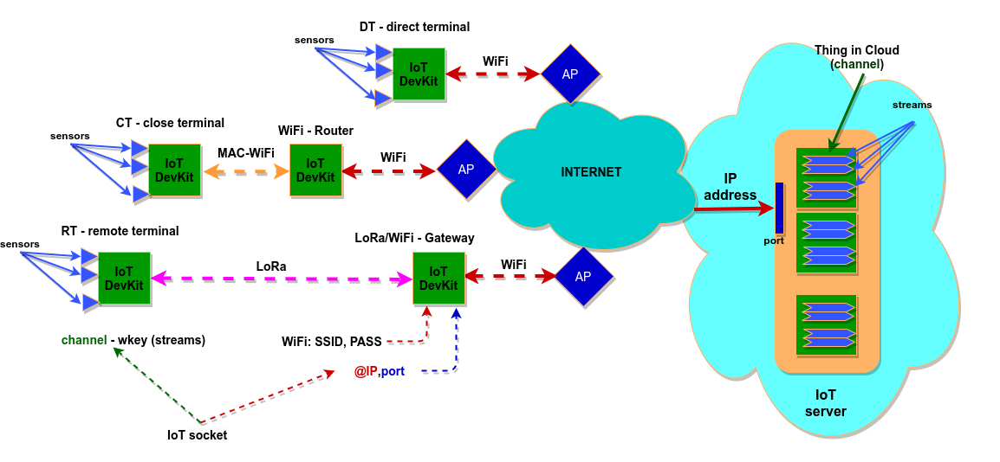
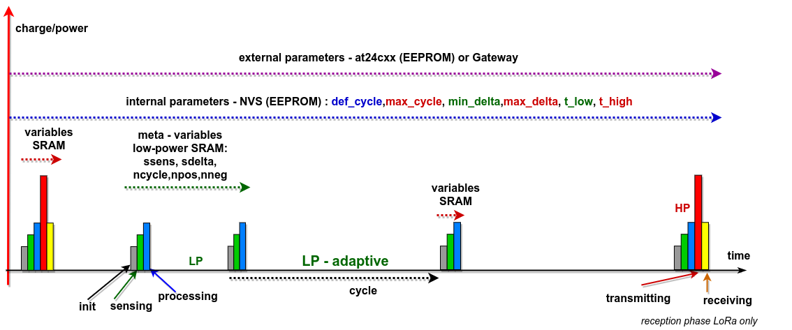
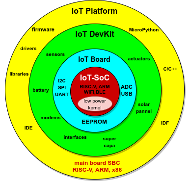
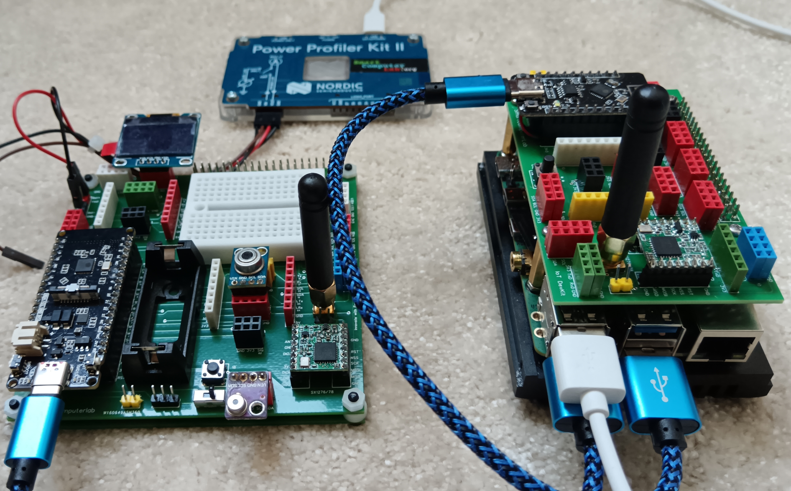
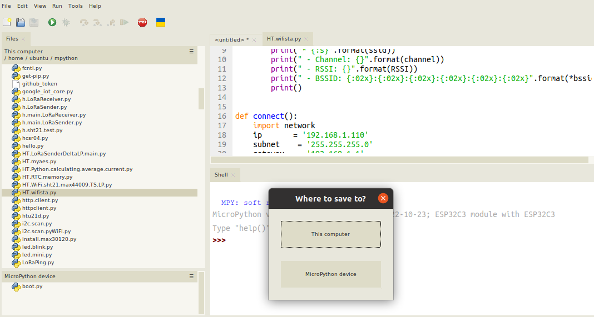

# Adaptive Low-Power IoT Protocols
### IoT DevKit (thing) mapping

  

### Adaptive Low-Power IoT Protocol timeline : cycles, stages and phases

  

## Workshop program
### Part 1
**Presentation** of **Direct Terminal** (WiFi) with simple communication to ThingSpeak server. Using wifi_tools.py module.

**Implementation** of **Low-Power Adaptive Protocol for Direct Terminal**. Analysis of memory hierarchy – introduction of power control meta-parameters and parameters. Main program and required additional modules tools. Power (current analysis) for Direct Terminal.

    
### Part 2 (optional)
**Presentation** of Close Terminal (MAC-WiFi) and MAC-WiFi Router with simple communication to ThingSpeak server. 

**Implementation** of **Low-Power Adaptive Protocol for Close Terminal**. Main program and required additional modules tools. Power (current analysis) for Close Terminal.

    
### Part 3
**Presentation** of **Remote Terminal** (MAC-WiFi) and LoRa-WiFi Gateway with simple communication to ThingSpeak server. 
**Implementation** of **Low-Power Adaptive Protocol for Remote Terminal**. AES protection and ACK packets. Main program and required additional modules tools. Power (current analysis) for Remote Terminal.

### Attention:
**All examples coded in µPython are prepared on RISC-V and x86 SBCs.** The hands-on part deals only with the preparation/modification of the parameters and running the prepared examples.

## Platform : Hardware and Software
### from IoT SoC to IoT Platform

  

### Integrated IoT Platform - RISC-V

  

### Integrated IoT Platform - x86

  

### MicroPython - Thonny IDE

  

